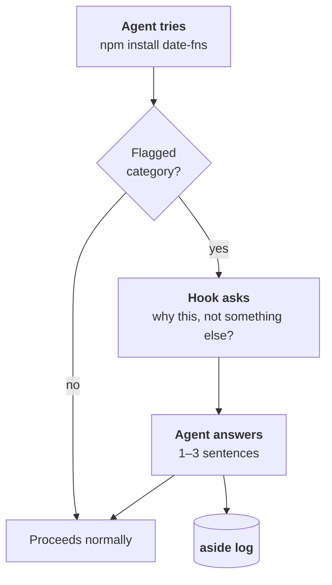

# Aside

> In theater, an *aside* is when a character steps away from the action to
> speak their internal thoughts directly to the audience — the rest of the
> scene doesn't hear it.
>
> This project asks an AI coding agent to do the same thing: step out for a
> beat, say why it's about to do something, then step back in and keep
> working. You never see the aside happen. It's just there in the log
> afterward, for whoever needs it.

 

## The problem

AI coding agents — Claude Code, Codex, or otherwise — make dozens of small
judgment calls while they work: why this dependency, why this structure,
why here and not somewhere else.

That reasoning usually never makes it past the terminal scrollback.

You're left staring at a finished diff, reconstructing "why" from scratch —
even though your name is the one going on the PR.

 

## The idea

Intercept specific categories of agent decisions *before they happen*.
Force a short rationale out of the model as the price of proceeding.
Quietly log it — the agent's aside.

Nothing is shown to you live. No extra prompts, no popups. The log just
exists afterward, so you (or a summary tool) can see why things were done —
not just what was done.

You never see that exchange happen. You just get the log.

 

## Not tied to one framework

The mechanism just needs some kind of pre-action interception point — a
hook, a middleware layer, anything that can sit between "agent decides to
act" and "action happens."

The first implementation targets Claude Code because that's what's
actually being built and tested right now. The concept applies to any
agentic system with an equivalent interception point.

 

## Why this, and not [thing that already exists]

**Not a permission prompt.**
Nothing here interrupts you or asks you to click allow/deny.
→ [alternatives considered](./docs/PRD-aside.md#alternatives-considered)

**Not an audit log.**
Plenty of tools log what an agent did. This forces it to say *why*.
→ [prior art](./docs/PRD-aside.md#prior-art)

**Not an eval.**
This doesn't grade whether the agent's output was correct — it gives a
human enough to judge that for themselves.
→ [relationship to loop engineering](./docs/PRD-aside.md#relationship-to-loop-engineering)

 

## What's in this repo

| File | What it is |
|---|---|
| [`PRD-aside.md`](./docs/PRD-aside.md) | Full spec: problem, goals, mechanism, prior art, cost tradeoffs, open questions |
| [`aside-sketch.md`](./docs/aside-sketch.md) | The hook mechanism in detail, with a flow diagram |
| [`THINKING.md`](./docs/THINKING.md) | How this idea evolved — including the framings that turned out to be wrong |

 

## Status

Prototype / concept stage. Not yet built.
