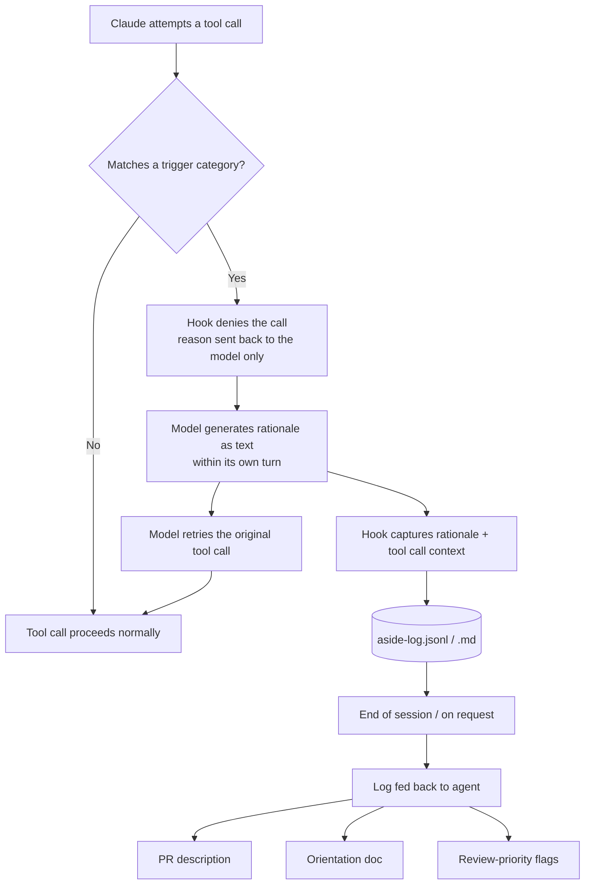

# aside — Hook Sketch

## What it does

A `PreToolUse` hook in Claude Code that intercepts specific categories of
tool call, forces the model to emit a short rationale before the call is
allowed to proceed, and silently appends that rationale to a structured log.
Nothing is shown to the user in real time — this is capture, not review.

## Trigger categories (start narrow, expand later)

These are examples of the kind of moment worth flagging, not the full scope.
The underlying idea is: any decision a reviewer would later ask "why did you
do it that way?" about, not just dependency/alternative choices specifically.
Starter list:

- New dependency installed (`npm install`, `pip install`, `cargo add`, etc.)
- New file created outside of trivial scaffolding
- New abstraction introduced (new class/interface/module exporting shared logic)
- Non-obvious naming (renaming something, or naming something in a way that
  isn't a direct restatement of its type/purpose)
- Structural choices — splitting/merging files, choosing where logic lives,
  picking a pattern (e.g. callback vs. promise, class vs. function)
- Deviating from an existing convention already present in the codebase
- Any file matching a "sensitive" glob you configure (e.g. auth, payments, migrations)

Deliberately excluded from triggers: reads, greps, routine edits that follow
an obvious existing pattern, test runs. Keeping the trigger list narrow is
what makes this different from a permission prompt — it should fire rarely,
on the moments that actually matter. The list should grow based on what
kinds of decisions actually turn out to need explaining in practice, not be
fixed to a specific handful of categories.

## Flow

Note: every step below happens between the hook script and the model. The
developer sees none of it — no dialog, no click, no wait beyond a small
amount of added latency on the flagged call.



Nothing in this flow is shown to the user live — the only visible outputs
are the downstream artifacts (J, K, L) generated on demand.

## Mechanism

Important distinction: this is a hook talking to the model, not a prompt
talking to the user. Nothing below is ever shown to the developer or
requires a click. The "deny" step is a script-level decision your own code
makes — the model gets told to try again with a rationale; you never see
that exchange happen.

1. Claude attempts a tool call (e.g. `Bash("npm install lodash")`).
2. The hook inspects the tool name + input against the trigger list.
3. If it matches: the hook returns `permissionDecision: "deny"` with a
   reason prompting a short rationale — the specific question depends on
   the trigger category (e.g. "why this approach over an alternative,"
   "why this name," "why here rather than an existing module"). State it
   in 1–3 sentences, then retry.
4. That reason is fed back to the model as if the tool call failed. The
   model's next step is to produce the rationale as text, entirely within
   its own turn — no human involved.
5. A second hook (or the same script, on the retried call) captures that
   rationale + the tool call it preceded, and appends a structured entry to
   `.claude/aside-log.jsonl` (or `.md`, see below).
6. The model retries the same tool call, which now goes through
   (`permissionDecision: "allow"`).

The round trip in steps 3–6 happens inside the model's own reasoning loop,
not the human-facing permission system. It may add a small amount of
latency to that one tool call; it does not produce a dialog box.

## Log entry format

```json
{
  "timestamp": "2026-07-05T14:32:10Z",
  "category": "dependency_added",
  "tool_call": "Bash",
  "input_summary": "npm install date-fns",
  "rationale": "Needed date parsing with timezone support; considered writing it manually but date-fns is already a peer dep of another package in use.",
  "files_context": ["src/utils/schedule.ts"]
}
```

Markdown alternative, if you'd rather grep/read it directly than parse JSON:

```markdown
### [14:32] Dependency added: date-fns
**Why:** Needed date parsing with timezone support; considered writing it
manually but date-fns is already a peer dep of another package in use.
**Context:** src/utils/schedule.ts
```

## Downstream uses (the actual point)

The log itself isn't the product — it's fuel for whatever consumes it later:

- **End-of-session summary** — feed the whole log back to Claude: "Here are
  all the flagged decisions from this session, write a PR description."
- **Orientation doc** — collapse the log into the goal/decisions/risks format
  from earlier, but now grounded in captured rationale instead of a cold
  reconstruction.
- **Anomaly flag** — a rationale that's oddly vague, generic, or
  contradicts its own context ("chose X because it's simple" for a decision
  that clearly wasn't) is itself a signal worth surfacing first.

## Open questions to prototype against

- Does forcing the rationale-then-retry step meaningfully slow down a
  session, and is that worth it given nothing is shown live?
- Does the trigger list need to be project-configurable from day one, or is
  a fixed starter list enough to test the concept?
- Retry loop risk: what if Claude's rationale generation itself fails to
  satisfy the hook (e.g. hook expects a certain format) — needs a fallback
  so it doesn't get stuck denying forever.
